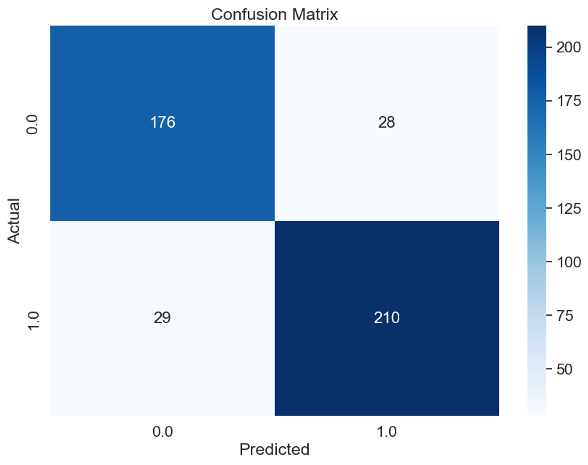
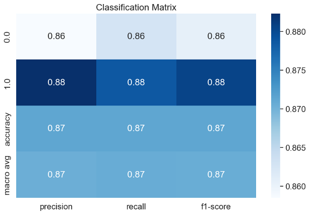
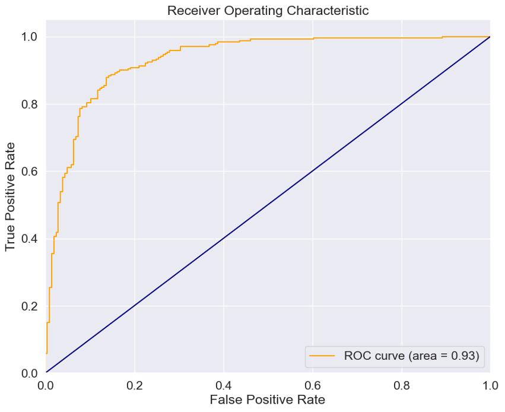
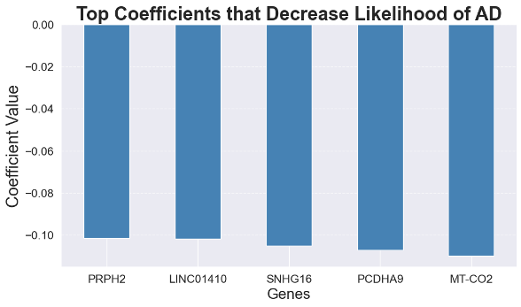
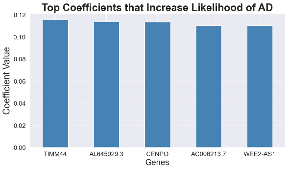

# Alzheimer’s Disease RNASeq Research Recommendations

## Alzheimer's Research Background
### Classic View - Amyloid Beta Plaques 
Alois Alzheimer himself noted the presence of these plaques when he first described the disease in 1906. However, it wasn't until the 1980s that scientists were able to identify the primary component of these plaques: a protein fragment known as amyloid-beta. The "amyloid cascade hypothesis" emerged as a dominant theory, suggesting that the accumulation of amyloid-beta in the brain is the primary influence driving Alzheimer's disease progression. Part of the dominance of this theory comes from the early recognition of the plaques in patients with Alzheimer's, however, it is unclear as to whether amyloid beta plaques and tau tangles lead to Alzheimer's Disease or if they are a product of the disease. In the last few years, multiple highly cited studies' data that supported this hypothesis have been called into question as fraudulent, casting further doubt on the dominance of this theory (see links below about this).

https://www.science.org/content/article/potential-fabrication-research-images-threatens-key-theory-alzheimers-disease
https://www.science.org/content/blog-post/faked-beta-amyloid-data-what-does-it-mean

### Glucose Metabolism Problems
In late 20th century, researchers began to understand the role of glucose metabolism in Alzheimer's. Positron emission tomography (PET) scans showed decreased glucose usage in the brains of Alzheimer's patients, indicating potential metabolic dysfunction. Studies have suggested that this dysfunction could lead to an energy crisis in the brain, affecting neuron health and function. Notably, some theories that align with this hypothesis include a dysfunction in the mitochondria. For example, one research paper states: "Our hypothesis unequivocally states in sporadic, late-onset AD, mitochondrial function affects amyloid precursor protein (APP) expression, APP processing, or beta amyloid (Aβ) accumulation and argues if an amyloid cascade truly exists, mitochondrial function triggers it." (Swerdlow) 

Swerdlow, R. H., Burns, J. M., & Khan, S. M. (2013). The Alzheimer's disease mitochondrial cascade hypothesis: Progress and perspectives. Biochimica et Biophysica Acta (BBA) - Molecular Basis of Disease. https://doi.org/10.1016/j.bbadis.2013.09.010

### Blood-Brain Barrier Dysfunction 
More recently, scientists have started to explore the role of the blood-brain barrier in Alzheimer's disease. The BBB, which protects the brain from harmful substances, appears to become leaky in Alzheimer's disease, potentially leading to inflammation and further neuronal damage. This area of research has gained more attention since the 2010s, but the exact mechanisms and implications are still being explored.

## RNA-Seq Overview
How RNA-Seq Works: 
- extract RNA
- make cDNA (complementary DNA) from it
- sequence cDNA to recreate RNA (this time with labels)
- run through machine to translate labels into sequence data
  

## Data Sources:
- ROSMAP (Religious Orders Study and Memory and Aging Project)
- MSBB (Mount Sinai Brain Bank)
- MAYO Clinic Study

## Key Metric:
Residual Counts: 
Normalized gene expression data
- normalization reduces technical variation and make samples more comparable
- high values = high RNA expression
- low values = low RNA expression

## Best Model: Logistic Regression
- Accuracy: 87%		
- ROC_AUC: 93%

## Model Metrics:

#### Confusion Matrix:

#### Classificaiton Matrix:

#### ROC AUC:

## Logistic Regression Weights

## Takeaways:
### Key Genes
### TIMM44:
TIMM44 is a protein that plays an essential role in the transport of other proteins into mitochondria, the energy factories of our cells. Specifically, it operates as part of the translocase of the inner mitochondrial membrane (TIM23) complex. The TIM23 complex is responsible for recognizing and ushering proteins with a mitochondrial targeting signal into the inner mitochondrial membrane and matrix. The function of TIMM44 is to anchor another protein called heat shock protein 70 (Hsp70) to the TIM23 complex. The interaction between TIMM44 and Hsp70 is crucial for the import process, which contributes to the overall function of the mitochondria and, subsequently, energy production and glucose metabolism within cells.

### MT-CO2:
MT-CO2 encodes one of the subunits of the Cytochrome c Oxidase (Complex IV), which is a part of the mitochondrial respiratory chain. This chain of proteins and molecules within the mitochondria is responsible for producing the majority of the cell's energy in the form of ATP through oxidative phosphorylation. The MT-CO2 protein is integral to the function of Complex IV, which catalyzes the last step of the respiratory chain where electrons are transferred to oxygen, reducing it to water. This process is coupled with the pumping of protons across the mitochondrial membrane, setting up a gradient that drives ATP production. Thus, MT-CO2 significantly contributes to cellular energy supply and impacts glucose metabolism.

### Long Non-coding RNAs
Our RNA sequence data exploration and modeling suggest that long non-coding RNAs (lncRNAs) could be important contributors to the disease process, yet our understanding of these RNA molecules is still in its early stages. In fact, four of the aforementioned top ten features are lncRNAs: AL645929.3, AC006213.7, WEE2-AS1, and LINC01410 (SNHG16 is a small nucleolar RNA). LncRNAs are RNA sequences that do not code for proteins. Although they don't produce proteins, they are increasingly recognized for their roles in regulating gene expression, guiding protein interactions, and even interacting with cellular structures. However, much of their precise functions, including that of AL645929.3, remain elusive. A better understanding of these enigmatic molecules could provide new insights into disease mechanisms and potentially uncover new therapeutic targets. 

## Next Steps
- Analyze and model on Whole Genome Sequencing for TIMM44 and MT-CO2
- look for variants between Alzheimer’s and Control
- Perform biological research Techniques on TIMM44 and MT-CO2
-- e.g. immunohistochemistry
- Gather more data, model on that and see if model coefficients change or if we can get a higher accuracy

## Data Acknowledgement

The results published here are in whole or in part based on data obtained from the AD Knowledge Portal (https://adknowledgeportal.org). Data generation was supported by the following NIH grants: P30AG10161, P30AG72975, R01AG15819, R01AG17917, R01AG036836, U01AG46152, U01AG61356, U01AG046139, P50 AG016574, R01 AG032990, U01AG046139, R01AG018023, U01AG006576, U01AG006786, R01AG025711, R01AG017216, R01AG003949, R01NS080820, U24NS072026, P30AG19610, U01AG046170, RF1AG057440, and U24AG061340, and the Cure PSP, Mayo and Michael J Fox foundations, Arizona Department of Health Services and the Arizona Biomedical Research Commission. We thank the participants of the Religious Order Study and Memory and Aging projects for the generous donation, the Sun Health Research Institute Brain and Body Donation Program, the Mayo Clinic Brain Bank, and the Mount Sinai/JJ Peters VA Medical Center NIH Brain and Tissue Repository. Data and analysis contributing investigators include Nilüfer Ertekin-Taner, Steven Younkin (Mayo Clinic, Jacksonville, FL), Todd Golde (University of Florida), Nathan Price (Institute for Systems Biology), David Bennett, Christopher Gaiteri (Rush University), Philip De Jager (Columbia University), Bin Zhang, Eric Schadt, Michelle Ehrlich, Vahram Haroutunian, Sam Gandy (Icahn School of Medicine at Mount Sinai), Koichi Iijima (National Center for Geriatrics and Gerontology, Japan), Scott Noggle (New York Stem Cell Foundation), Lara Mangravite (Sage Bionetworks).

Cite:

https://doi.org/10.1038/sdata.2016.89
https://doi.org/10.1038/sdata.2018.185
https://doi.org/10.1038/sdata.2018.142

